# InfoBot: Architecture and Workflow Map

Derived from the source in `app/`, `db/migrations/`, `.env.example`, `requirements.txt`, the live Supabase schema (read through the Supabase MCP on 2026-10-01) and the repo docs. The code is the source of truth. `docs/` and the original plan were used only where cross-checked against code. Anything I could not prove is marked **⚠️ UNVERIFIED**.

Snapshot: branch `master`, with a large uncommitted change set (see §10). Diagrams are Mermaid; paste them into any Mermaid renderer.

---

## 1. Project summary

InfoBot is a WhatsApp fact-checking bot for India. A user forwards text, a screenshot, a voice note or a short video to a Meta Cloud API number. The bot turns the media into labelled text, screens it for prompt injection, looks for a cached answer, extracts up to 3 checkable claims, verifies each by tier (model knowledge, web search, soft health guidance or a fixed medical hard stop), and replies as a contextual reply in English, Hindi or Marathi with a verdict, a confidence label and sources.

There is **no frontend application**. The only "client" is WhatsApp. `site/` is a static landing, privacy and data-deletion site.

## 2. Technology stack

```text
Frontend:        none (WhatsApp is the UI). Static site in site/ (HTML + CSS)
Backend:         Python 3.10 (per CLAUDE.md), FastAPI, uvicorn, httpx, pydantic-settings
Database:        Supabase Postgres + pgvector, reached over REST/PostgREST with the service key (no ORM)
Authentication:  none for users. Meta HMAC-SHA256 signature on the webhook; GET verify token; API keys in headers
External APIs:   Meta WhatsApp Graph API, Gemini (Interactions + embeddings), Groq (LLM fallback, Prompt Guard,
                 Whisper fallback), Tavily (search), ElevenLabs Scribe (speech to text)
Media tooling:   ffmpeg and ffprobe run as local subprocesses
Infrastructure:  laptop + ngrok tunnel today; no Dockerfile, CI, or deploy config in the repo
Deployment:      none for the bot. site/ is stated in docs to be on Netlify (no netlify.toml in repo)
```

## 3. Component map

| Component | Location | Responsibility | Depends on |
|---|---|---|---|
| App + routes + handler | `app/main.py` | `/health`, `/trending`, `GET/POST /webhook`; per-message handler `handle_message`; media handlers; failure replies; startup sweep | everything below |
| Settings | `app/config.py` | env-driven settings (pydantic-settings, `.env`) | none |
| Signature check | `app/whatsapp/verify.py` | HMAC-SHA256 over the raw body vs `X-Hub-Signature-256` | config |
| Parser | `app/whatsapp/parser.py` | flatten Meta payload to `InboundMessage` (text, image, audio, video, reaction, interactive) | none |
| WhatsApp client | `app/whatsapp/client.py` | send text reply, reply buttons, mark read, two-step media download | Meta Graph API |
| Language commands | `app/pipeline/language.py` | exact-match language menu / choice commands and button ids | none |
| Guard | `app/pipeline/guard.py` | strip hidden chars, regex injection rules, Groq Prompt Guard 2, `wrap_untrusted`, `sanitize_output`, `guess_language`, size caps | Groq |
| Normalize | `app/pipeline/normalize.py` | image to labelled text (Gemini vision), audio/video to transcript (ffmpeg, Scribe, Whisper) | Gemini, ElevenLabs, Groq, ffmpeg |
| Orchestrator | `app/pipeline/orchestrator.py` | text pipeline: guard, exact cache, classify, per-claim cache and verify, compose | pipeline modules, db.cache |
| Classify | `app/pipeline/classify.py` + `prompts/extract_classify.txt` | one Gemini call: input kind, up to 3 claims with tier, language, domain, search queries | Gemini |
| Verify | `app/pipeline/verify.py` + `prompts/verify_t*.txt` | T1, T2, T3a verification, structural confidence, `translate_texts` | Gemini, Tavily |
| Compose | `app/pipeline/compose.py`, `messages.py`, `confidence.py` | build reply cards (verdict card, multi-claim, non-claim, static en/hi/mr text, confidence buckets) | prompts, messages |
| Gemini provider | `app/providers/gemini.py` | `generate_json`, `embed_text`, key rotation, cooldowns, concurrency cap 4 | Gemini API, fallback_llm |
| Groq fallback | `app/providers/fallback_llm.py` | text-only JSON generation when Gemini fails | Groq |
| Tavily provider | `app/providers/tavily.py` | bilingual claim search plus one fact-check-domain pass | Tavily |
| Scribe | `app/providers/elevenlabs.py` | primary speech to text | ElevenLabs |
| Whisper | `app/providers/whisper.py` | fallback speech to text (Groq, else OpenAI) | Groq / OpenAI |
| DB client | `app/db/client.py` | thin PostgREST wrapper (get / post / patch) | Supabase |
| Cache | `app/db/cache.py` | hash, exact lookup, semantic lookup (`rpc/match_claims`), `times_seen`, insert | DB client |
| Submissions | `app/db/submissions.py` | idempotency claim, status marks, reply wamid link, stale sweep | DB client |
| Rate limit | `app/db/rate_limit.py` | `rpc/increment_rate_limit`, hourly window | DB client |
| Prefs | `app/db/prefs.py` | per-user reply language; fails soft | DB client |
| Feedback / Trending | `app/db/feedback.py`, `app/db/trending.py` | reaction rows; top claims by `times_seen` | DB client |
| Util | `app/util.py` | salted hashes of phone and wamid, `ref()` log id | config |
| Scripts / tests | `scripts/`, `tests/`, `claims_test/` | live fixture and scenario runners; offline unit tests; manual test messages | app |
| Static site | `site/` | landing, privacy, data deletion | none |

## 4. Master workflow

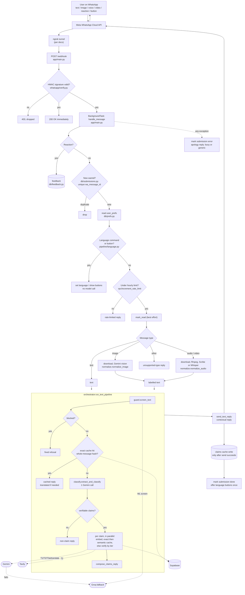

## 5. Detailed workflows

### 5.1 Application startup

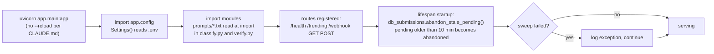

There is no startup DB connection: each DB call opens its own `httpx` client (`app/db/client.py`). Media tools are not checked at startup.

### 5.2 Webhook and per-message handler

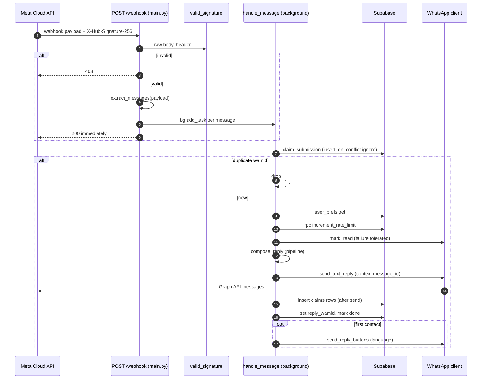

### 5.3 Message handler decisions

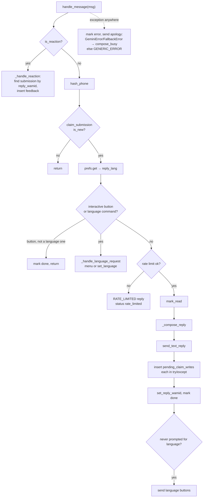

### 5.4 Media to text

```mermaid
flowchart TD
    subgraph IMAGE["image (main._compose_image_reply)"]
        I1["download_media: Graph GET url, then GET file"] --> I2{"over 6 MB?"}
        I2 -- yes --> I2R["unreadable-media reply"]
        I2 -- no --> I3["normalize_image: one Gemini vision call<br/>schema: readable text, description, kind"]
        I3 -- "GeminiError" --> I3A{"caption?"}
        I3A -- yes --> I3B["check caption as text"]
        I3A -- no --> I3C["busy reply (no vision fallback)"]
        I3 --> I4{"text found?"}
        I4 -- yes --> I5["labels: Text inside the image,<br/>Caption, What the image shows"]
        I4 -- no --> I6{"photo with description?"}
        I6 -- yes --> I7["photo-only reply:<br/>cannot judge authenticity"]
        I6 -- no --> I8["unreadable reply"]
    end

    subgraph AUDIO["audio / video (main._compose_audio_or_video_reply)"]
        A1["download_media"] --> A2{"over 17 MB?"}
        A2 -- yes --> A2R["too-long reply"]
        A2 -- no --> A3{"video?"}
        A3 -- yes --> A4["ffmpeg: audio only, 16 kHz mono WAV,<br/>first 185 s"]
        A3 -- no --> A5["audio bytes as-is"]
        A4 --> A6["ffprobe duration"]
        A5 --> A6
        A6 --> A7{"over 180 s?"}
        A7 -- yes --> A7R["too-long reply (before any paid call)"]
        A7 -- no --> A8["ElevenLabs Scribe"]
        A8 -- "fails" --> A9["Groq Whisper<br/>(else OpenAI)"]
        A8 -- "empty result" --> A10["empty: no speech"]
        A9 -- "fails" --> A11["None: busy reply"]
        A8 --> A12["clean_transcript<br/>strip sound labels"]
        A9 --> A12
        A12 --> A13{"speech left?"}
        A13 -- yes --> A14["label: Voice note / Video transcript<br/>+ Caption"]
        A13 -- no --> A15["caption only, else unreadable"]
    end
```

ffmpeg and ffprobe run through `asyncio.to_thread(subprocess.run, ...)` (see `normalize._run`).

### 5.5 Text pipeline

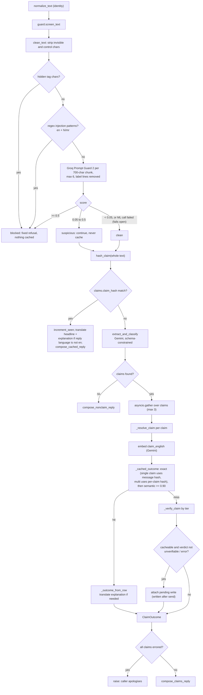

### 5.6 Verification tiers

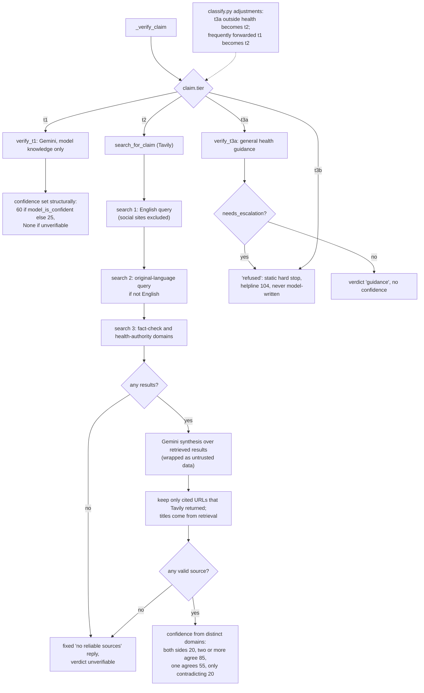

### 5.7 Language preference

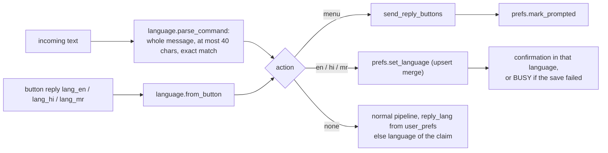

### 5.8 Reaction (feedback) flow

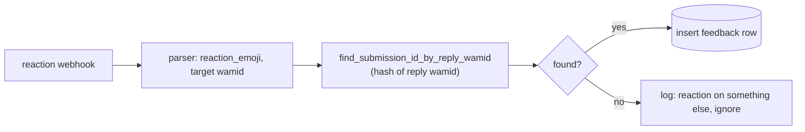

Reactions return before the idempotency insert (see §10, finding 3).

### 5.9 Error and fallback paths

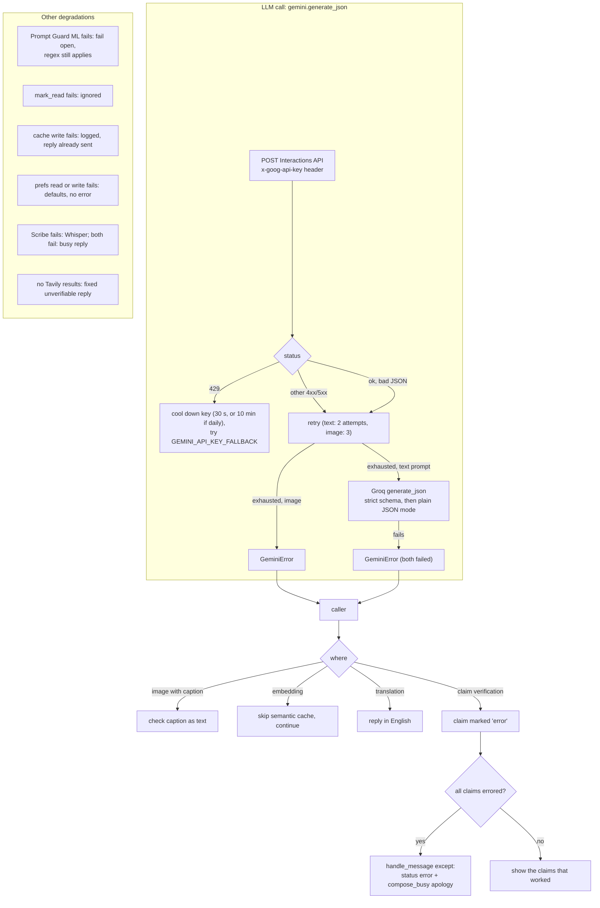

## 6. Data flow

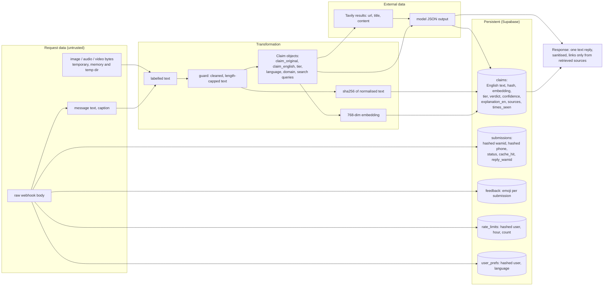

| Data | Kind | Notes |
|---|---|---|
| Phone number | request, persistent only as hash | `hash_phone` (salted sha256) stored as `wa_user_hash`. Raw number is used only to send the reply |
| wamid | request, persistent only as hash | `hash_id` (different prefix). The raw wamid embeds the number in base64, which is why it is hashed. Logs use `ref()` |
| Message text and media | request, temporary | Never stored. Only the English claim text of cached claims is stored |
| Claims cache | persistent | English only. A cached answer for another language is translated on read (`translate_texts`) |
| Model output | external, shown to user | passes through `sanitize_output` (no links, phone numbers, control chars). Only Tavily-returned URLs reach the user |
| Config and secrets | config | `.env` (git-ignored). Keys go in headers, never URLs |

## 7. External integrations

Verified by calls in the current code.

| Service | Used by | Purpose | Direction | Credential |
|---|---|---|---|---|
| Meta Graph API | `whatsapp/client.py` | send reply, buttons, read receipt, resolve and download media | out | `WA_TOKEN` bearer, `WA_PHONE_NUMBER_ID`, `WA_API_VERSION` |
| Meta webhook | `main.py`, `whatsapp/verify.py` | inbound messages, reactions, buttons | **in** | `WA_APP_SECRET` (HMAC), `WA_VERIFY_TOKEN` (GET handshake) |
| Gemini Interactions API | `providers/gemini.py` | classify, verify, translate, image reading | out | `x-goog-api-key`: `GEMINI_API_KEY`, then `GEMINI_API_KEY_FALLBACK`; model in `GEMINI_MODEL` |
| Gemini embeddings | `providers/gemini.py` | 768-dim claim embeddings | out | same keys; `GEMINI_EMBED_MODEL` |
| Groq chat | `providers/fallback_llm.py` | text fallback, model `GROQ_MODEL` | out | `GROQ_API_KEY` bearer |
| Groq Prompt Guard | `pipeline/guard.py` | injection score | out | same key; `PROMPT_GUARD_MODEL` |
| Groq Whisper (else OpenAI) | `providers/whisper.py` | transcription fallback | out | `GROQ_API_KEY`, else `OPENAI_API_KEY` |
| Tavily | `providers/tavily.py` | web search for T2 | out | `TAVILY_API_KEY` bearer |
| ElevenLabs Scribe | `providers/elevenlabs.py` | primary transcription | out | `xi-api-key` |
| Supabase REST | `db/*.py` | all persistence | out | `SUPABASE_SERVICE_KEY` (apikey + bearer) |

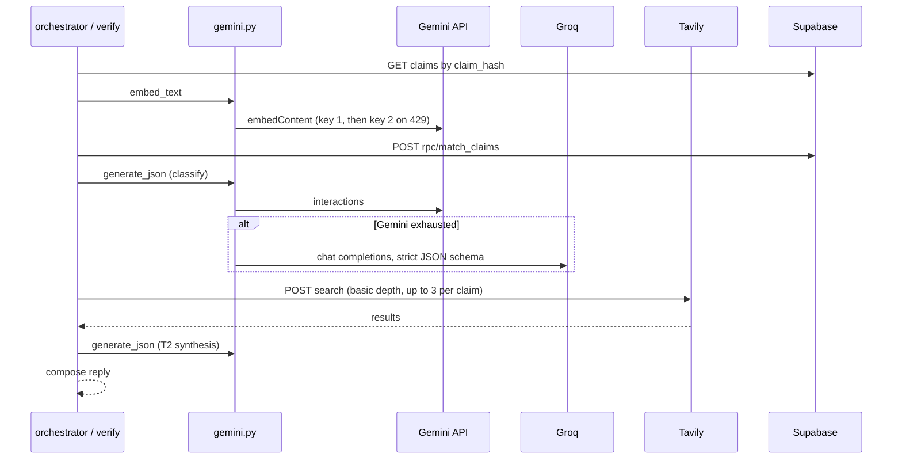

**Configured but not used by the code:** `OPENROUTER_API_KEY` (defined in `config.py`, `.env.example`, referenced nowhere else).

## 8. Database flow

Live schema, read from Supabase on 2026-10-01: five tables in `public`, all with RLS enabled. **Only `user_prefs` has a migration in the repo** (`db/migrations/001_user_prefs.sql`); the other four were applied directly.

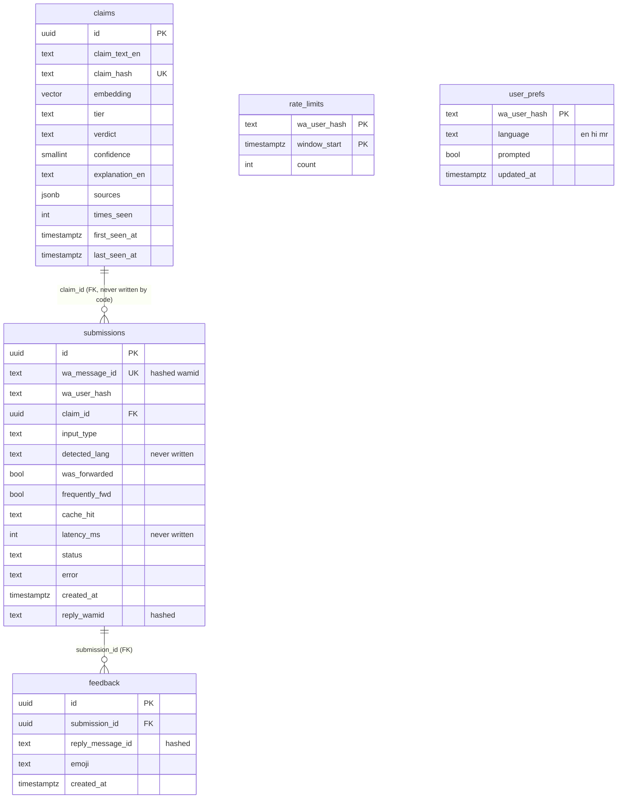

`rate_limits` and `user_prefs` have no foreign keys; they join to `submissions` only by the shared `wa_user_hash` value.

| Operation | Code | Table / function |
|---|---|---|
| Idempotency insert | `submissions.claim_submission` | `submissions`, `on_conflict=wa_message_id`, `ignore-duplicates` |
| Status update | `mark_submission`, `set_reply_wamid`, `abandon_stale_pending` | `submissions` (PATCH) |
| Exact cache | `cache.lookup_exact` | `claims` by `claim_hash` |
| Semantic cache | `cache.lookup_semantic` | RPC `match_claims` (threshold `SEMANTIC_MATCH_THRESHOLD`, 0.90) |
| Popularity | `cache.increment_seen` (read then patch, non-atomic) | `claims.times_seen`, `last_seen_at` |
| Cache write | `cache.insert_claim` | `claims` (after a successful send only) |
| Rate limit | `rate_limit.check_and_increment` | RPC `increment_rate_limit`, window = current UTC hour, cap `RATE_LIMIT_PER_HOUR` (20) |
| Language | `prefs.get/set_language/mark_prompted` | `user_prefs` |
| Feedback | `feedback.insert_feedback` | `feedback` |
| Trending | `trending.get_trending` | `claims` ordered by `times_seen` over 7 days, exposed at `GET /trending` |

**⚠️ UNVERIFIED:** the bodies of `match_claims` and `increment_rate_limit` as deployed (I saw tables, not functions; the plan §5.1 gives `match_claims`). Also the HNSW index and any RLS policies (RLS is on; `user_prefs` documents "no policies").

## 9. Infrastructure flow

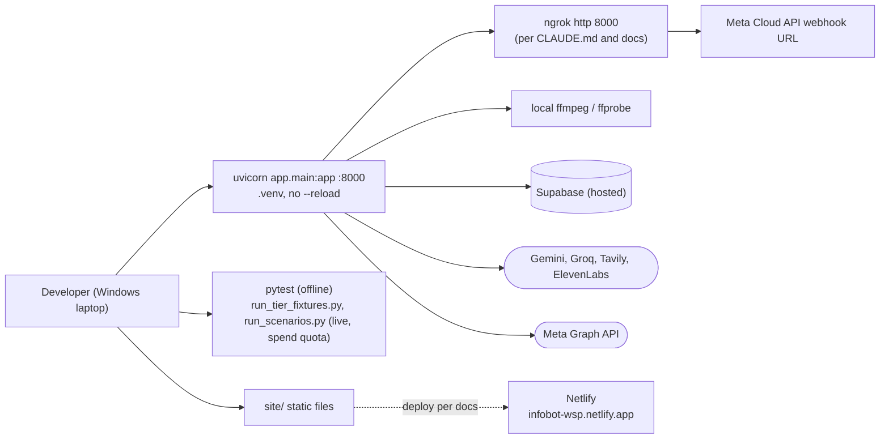

| Item | State |
|---|---|
| Container | none: no Dockerfile or compose file |
| CI/CD | none: no `.github/`, no pipeline config |
| Dependencies | `requirements.txt`: fastapi, uvicorn[standard], httpx, python-dotenv, pydantic, pydantic-settings. **Unpinned.** `requirements-dev.txt` exists (not opened) |
| System dependency | ffmpeg and ffprobe must be on PATH. Nothing in the repo declares this |
| Ports / volumes / networks | only `--port 8000`. No volumes; temp files use `tempfile.TemporaryDirectory` |
| Production host | none (docs: "no production host yet") |
| Netlify | **⚠️ UNVERIFIED** from the repo: docs say `site/` is deployed there, but no `netlify.toml` or deploy config exists here |
| ngrok | **⚠️ UNVERIFIED** as running: documented in CLAUDE.md and docs only |

## 10. Important findings

**Architecture patterns**
- Webhook returns 200 at once and does all work in a FastAPI `BackgroundTask`. No queue.
- Linear pipeline with hard stages: guard, cache, classify, tiered verify, compose. Untrusted text is wrapped and all output is sanitised.
- Confidence is computed from structure (T1 pinned at 60/25, T2 from distinct agreeing domains), never self-reported by the model.
- Cache writes happen only after a successful send; nothing suspicious, blocked, unverifiable or errored is cached.
- Every optional layer fails soft (prefs, embeddings, translation, Prompt Guard, read receipt).

**Critical dependencies and single points of failure**
- Supabase: `claim_submission` is the first call for every non-reaction message. If Supabase is down, every message ends in the apology path.
- Gemini is the only vision provider, so there is no image fallback. Text falls back to Groq.
- One Groq key serves three jobs (Prompt Guard, LLM fallback, Whisper fallback), so they share one rate limit.
- A single uvicorn process on a laptop: in-flight jobs are lost on restart. The startup sweep only marks stale rows `abandoned`; it cannot retry or notify the user.
- Key cooldown state (`_cooldown_until`) lives in process memory.

**Potential issues found in the code**
1. **Reactions skip idempotency.** `handle_message` returns from `_handle_reaction` before `claim_submission`, so a redelivered reaction webhook inserts a duplicate `feedback` row.
2. **Embedding before exact lookup.** `_resolve_claim` calls Gemini embeddings before `_cached_outcome`, so a claim that would hit the exact cache still costs an embed call (single-claim exact whole-message hits are caught earlier in `run_text_pipeline`; multi-claim exact hits are not).
3. **Sequential Tavily calls.** `search_for_claim` awaits up to three searches one after another per T2 claim, which adds latency.
4. **`increment_seen` is read-then-write** (2 round trips, non-atomic). Documented in its docstring as acceptable.
5. **Dead config and columns.** `OPENROUTER_API_KEY`, `submissions.detected_lang`, `submissions.latency_ms` and the `submissions.claim_id` link are never written by the code. The `feedback` table has 0 rows.
6. **`GET /trending` is unauthenticated** and returns cached claim text and verdicts. The plan left a public dashboard as an open decision, so this may be intentional; flagging it only.
7. **Sensitive-data disclosure gap** is already tracked in `docs/TASKS.md` (privacy page omits Groq).

**Documentation vs code**
- `docs/PROJECT_CONTEXT.md` lists "Cache hits answer in English only" under known limitations, but `orchestrator.py` translates cached explanations via `translate_texts`. The doc looks stale.
- `docs/PROJECT_CONTEXT.md` says no migration files are in the repo; `db/migrations/001_user_prefs.sql` now exists (for `user_prefs` only).
- `CLAUDE.md` says Python 3.10; the original plan assumed 3.11+.
- The plan assumed free-tier hosting; the code is currently run on a laptop with no host chosen.

**State of the repo**
- `git status` shows many modified tracked files and untracked files (`app/db/prefs.py`, `app/pipeline/language.py`, `tests/test_language.py`, `db/`, the new docs). Commit and push are waiting on the owner per `docs/TASKS.md`.
- 12 test files under `tests/` (offline). Live runners spend API quota.

---

*Verification method:* every arrow in the diagrams was traced to a function call, route, config value or DB call in the files cited; the database section was also checked against the live Supabase schema. Items that rely only on docs or the plan are marked ⚠️ UNVERIFIED.
